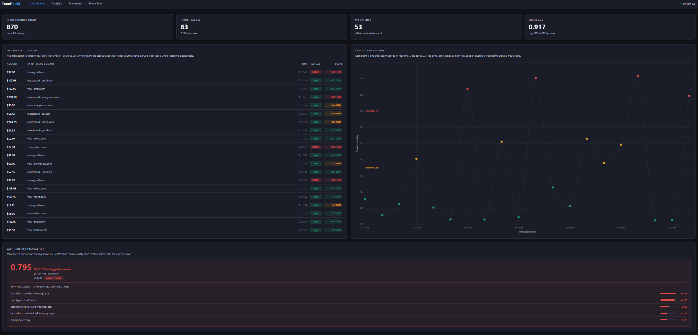
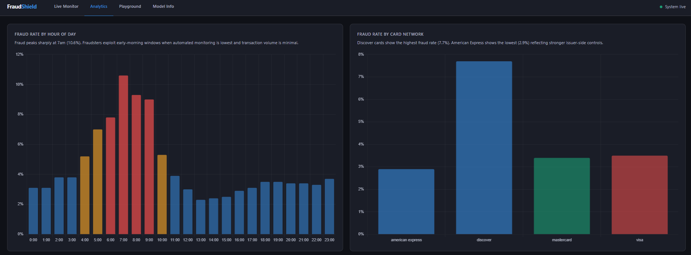
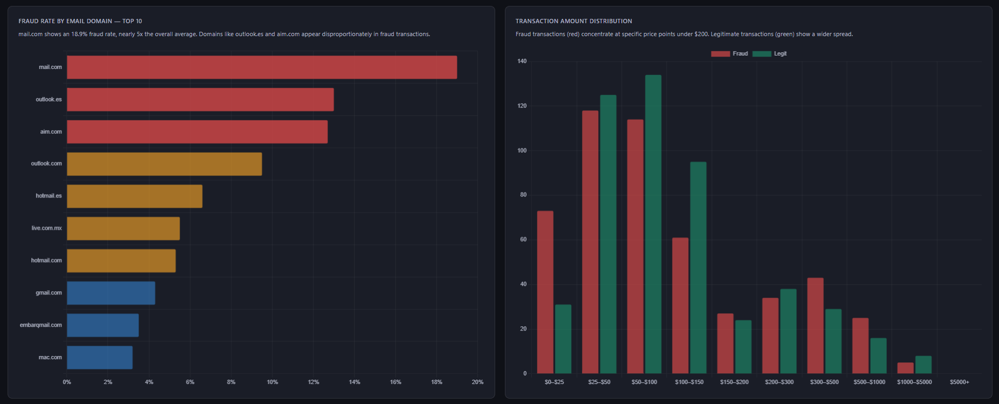
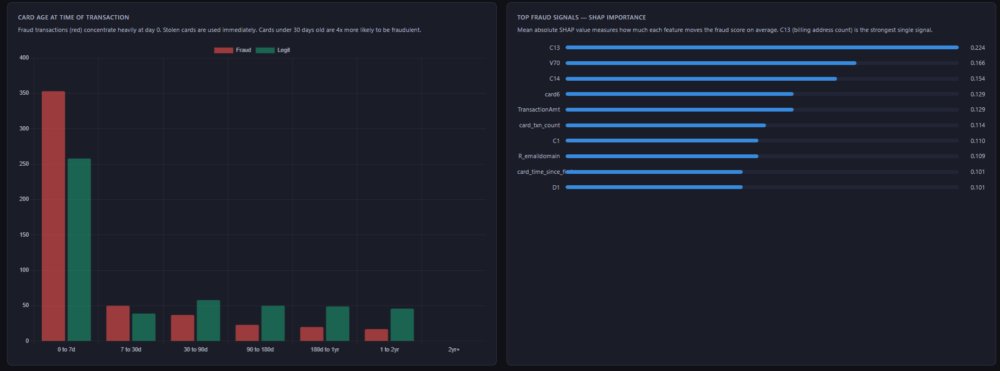
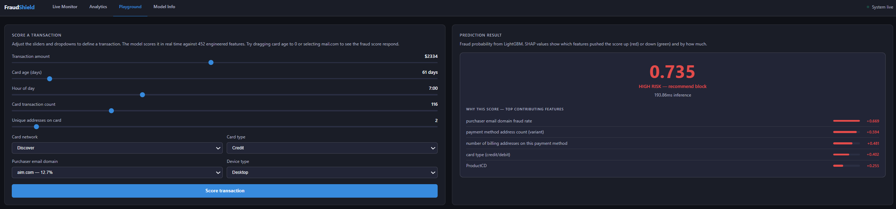
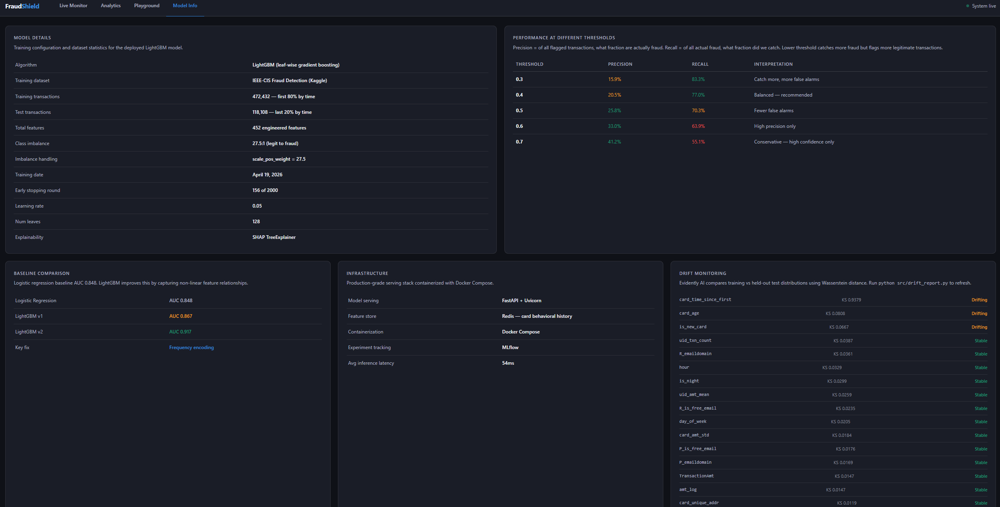

# FraudShield: Real-Time Fraud Detection System

A production ML pipeline that scores financial transactions for fraud in real time. Built with LightGBM, FastAPI, Redis, Docker, and Evidently AI. Ships with a live monitoring dashboard, SHAP explainability on every prediction, behavioral feature engineering, and automated drift detection.

**AUC 0.917** on 118,108 held-out test transactions. Sub-50ms inference latency. 452 engineered features.

## Demo

[](https://www.loom.com/share/d96f728510744bf8a959cc95d16feef6)

[Watch full demo on Loom](https://www.loom.com/share/d96f728510744bf8a959cc95d16feef6) : real transactions streaming through the API, fraud score timeline updating in real time, SHAP explainability on flagged transactions, and the interactive playground.

## Results

**Model comparison**

| Model | AUC | Key change |
| :--- | :--- | :--- |
| Logistic Regression (baseline) | 0.848 | Linear features only |
| LightGBM v1 | 0.867 | Target encoding on card columns |
| LightGBM v2 | **0.917** | Frequency encoding, leakage fixed |

The jump from v1 to v2 came from a single change. Target encoding high-cardinality card columns caused the model to memorize which specific cards were fraudulent in training rather than learning generalizable behavioral patterns. Switching to frequency encoding pushed AUC from 0.867 to 0.917 in one run.

The overall 8.1% improvement over logistic regression comes from LightGBM capturing non-linear interactions between behavioral features. A logistic regression treats card age, transaction velocity, and amount deviation as independent signals. LightGBM learns that a new card with an unusually large amount at 3am is far more suspicious than any of those three factors would suggest on their own.

The three most predictive features according to SHAP are C13 (billing address count on the payment method), card time since first seen, and transaction amount deviation from card average. Two of those three are features we engineered from raw data. They were not in the original dataset.

**Threshold analysis**

| Threshold | Precision | Recall | What it means in practice |
| :--- | :--- | :--- | :--- |
| 0.3 | 15.9% | 83.3% | Catches most fraud, many false alarms |
| 0.4 | 20.5% | 77.0% | Balanced starting point |
| 0.5 | 25.8% | 70.3% | Fewer false alarms, misses more fraud |
| 0.6 | 33.0% | 63.9% | High confidence flags only |
| 0.7 | 41.2% | 55.1% | Very conservative, misses nearly half of fraud |

Precision answers: of all the transactions flagged as fraud, what fraction were actually fraud? Recall answers: of all the actual fraud in the dataset, what fraction did we catch?

The tradeoff is fundamental and cannot be avoided. Lowering the threshold catches more fraud but also blocks more legitimate transactions. Raising it reduces false alarms but lets more fraud through. The right threshold depends on the business. If a fraudulent charge costs the company $500 and blocking a legitimate transaction costs $5 in customer friction, the math points toward a lower threshold. A bank handling wire transfers would weight these very differently than a subscription platform.

At threshold 0.4, this model catches 77% of all fraud while keeping false alarms at a level a fraud review team can handle. That is the recommended operating point for most fintech use cases.

## Architecture

```
Raw CSV (590k transactions)
        |
        v
Feature Engineering  (src/features.py)
  452 features including time, amount deviation,
  card age, transaction velocity, and uid aggregations
        |
        v
LightGBM Training  (src/train.py)
  scale_pos_weight 27.5 for 27:1 class imbalance
  Early stopping at round 156 of 2000
  MLflow experiment tracking across all runs
        |
        v
SHAP Explainability  (src/explain.py)
  TreeExplainer computes per-prediction feature attribution
        |
        v
Docker Compose
  FastAPI on port 8000  talking to  Redis on port 6379
  FastAPI handles scoring, SHAP, and serving the dashboard
  Redis stores rolling per-card behavioral statistics
        |
        v
Live Dashboard  (static/index.html)
  Four pages: Monitor, Analytics, Playground, Model Info
        |
        v
Drift Detection  (src/drift_report.py)
  Evidently AI, Wasserstein distance on 20 monitored features
  HTML report and JSON summary served via API endpoints
```

## Feature Engineering

The features that moved the needle most were not in the dataset. They came from thinking about what a fraud analyst would actually want to know about a card before making a decision.

**Amount deviation per card.** Instead of the raw transaction amount, we compute how many standard deviations the current amount is from that card's historical average. A $500 charge on a card that averages $20 is a very different signal from a $500 charge on a card that regularly spends $600. The raw amount tells you almost nothing. The deviation tells you a lot.

**Card behavioral fingerprint.** For each card we track total transaction count, unique billing addresses, unique email domains, standard deviation of amounts, and time since first seen. These live in Redis and update after every transaction so the model always has fresh behavioral context when scoring the next charge.

**Customer identity composite.** The combination of card number, billing address, and days since first use forms a more precise customer identifier than card number alone. Two people can share the same card BIN but not the same card plus billing address plus days-since-first-use combination. Aggregations on this composite key outperformed card-level aggregations meaningfully.

**Frequency encoding over target encoding.** Card columns are encoded by how frequently they appear in the dataset rather than by their historical fraud rate. High-cardinality columns with few observations produce noisy fraud rate estimates when target-encoded. The model latches onto those estimates and memorizes which specific cards were fraudulent rather than learning generalizable behavioral patterns. Switching from target encoding to frequency encoding pushed AUC from 0.867 to 0.917 in a single run.

## Dashboard

The dashboard has four pages accessible from the navigation bar. Screenshots below are from a live run with the replay script streaming test transactions through the API.

### Live Monitor


Transactions stream through the API at 1.5 second intervals. The feed shows amount, card network, email domain, ground truth label when replaying labeled data, and model score color coded by risk level. The timeline chart on the right builds in real time with X and Y axes, threshold lines at 0.7 and 0.35, and color coded points. The last high risk transaction block below shows the full SHAP breakdown for the most recent flagged transaction.

### Analytics





Six charts computed from all 590,540 training transactions. Fraud peaks at 7am at a 10.6% rate. Discover cards show the highest fraud rate at 7.7%. mail.com has a fraud rate of 18.9%, nearly five times the dataset average. Fraud transactions cluster heavily at card age zero meaning stolen cards are used immediately after compromise. The SHAP importance chart shows which features drove predictions across the entire test set.

### Playground



Sliders for transaction amount, card age, hour of day, transaction count, and unique addresses. Dropdowns for card network, type, email domain, and device. The model rescores automatically as you move the sliders with a 500ms debounce. SHAP bars update instantly to show which inputs pushed the score up or down. Dragging card age from 200 days to 0, or switching the email domain to mail.com, produces an immediate visible jump in the fraud score.

### Model Info



Training configuration, threshold performance table showing precision and recall at five different cutoffs, baseline comparison against logistic regression, infrastructure summary, and live drift monitoring results pulled from the Evidently report.

## Drift Detection

Drift monitoring compares the training distribution against held-out test transactions using Evidently AI and Wasserstein distance for numerical features. It is designed to run as a periodic batch job once sufficient transaction volume has accumulated rather than updating continuously. In production this would be scheduled via Airflow to run nightly, comparing the training distribution against the past N days of scored transactions. A minimum of around 5,000 current transactions is needed for statistically stable results.

To run it manually at any time:

```bash
python src/drift_report.py
```

This generates an interactive HTML report at `models/drift_report.html` and a JSON summary served by the API at `/drift/summary`. The Model Info page reads this summary and displays per-feature drift status. The full Evidently report with distribution plots is available at `/drift/report`.

Out of 20 monitored features, 2 drifted when comparing the training period against the test period. `card_time_since_first` had a Wasserstein distance of 4.08, which is extreme and expected. As the dataset progresses through time, cards that were new early on have been seen for much longer by the test period. This is a temporal artifact of the feature engineering rather than genuine fraud pattern drift, and it points to a future improvement of capping the feature or computing it relative to a rolling window rather than the dataset start.

`card_age` had a Wasserstein distance of 0.10, a natural shift as the card population matures over the 6-month collection window.

The 18 stable features include `amt_to_card_mean_ratio` and `amt_z_score_card`. Relative behavioral features are inherently more stable over time than absolute value features. This validated the decision to engineer deviation-based features.

## Tech Stack

| Component | Technology | Purpose |
| :--- | :--- | :--- |
| Model | LightGBM 4.6 | Gradient boosting on tabular fraud data |
| Explainability | SHAP TreeExplainer | Per-prediction feature attribution |
| Feature store | Redis 7 | Rolling per-card behavioral statistics |
| API | FastAPI + Uvicorn | Model serving at sub-50ms latency |
| Containerization | Docker Compose | Redis and API in isolated containers |
| Experiment tracking | MLflow | Parameter logging and model versioning |
| Drift monitoring | Evidently AI 0.7 | Wasserstein distance on feature distributions |
| Dashboard | HTML, CSS, JavaScript | Four-page live monitoring interface |
| Data processing | Pandas, NumPy | Feature engineering on 590k rows |

## Project Structure

```
fraud-detection/
├── src/
│   ├── features.py            Feature engineering pipeline, 452 features
│   ├── train.py               Model training with MLflow tracking
│   ├── explain.py             SHAP explainability wrapper class
│   ├── api.py                 FastAPI serving layer with Redis integration
│   ├── feature_store.py       Redis feature store for card behavioral history
│   ├── replay.py              Test dataset replay for live dashboard demo
│   ├── drift_report.py        Evidently drift detection and HTML report generation
│   └── compute_analytics.py   Pre-compute analytics data for dashboard charts
├── notebooks/
│   ├── 01_eda.ipynb           Exploratory data analysis on 590k transactions
│   └── 02_shap.ipynb          SHAP summary plots and force plot analysis
├── static/
│   └── index.html             Four-page monitoring dashboard
├── models/                    Trained model, encodings, drift reports (gitignored)
├── data/                      Raw CSV files (gitignored, download from Kaggle)
├── Dockerfile                 API container build definition
├── docker-compose.yml         Redis and API orchestration
└── requirements.txt           Python dependencies
```

## How to Run

You need Docker Desktop, Python 3.11, and the IEEE-CIS Fraud Detection dataset from [Kaggle](https://www.kaggle.com/competitions/ieee-fraud-detection/data). Place `train_transaction.csv` and `train_identity.csv` in the `data/` folder before starting.

**Install dependencies**

```bash
python -m venv venv
venv\Scripts\activate
pip install -r requirements.txt
```

**Train the model**

```bash
python src/train.py
```

Takes 5 to 10 minutes. Saves the model to `models/lgbm_auc0.9178.txt` and logs all parameters and metrics to MLflow.

**Generate analytics and drift report**

```bash
python src/compute_analytics.py
python src/drift_report.py
```

**Start the system**

```bash
docker-compose up --build
```

Starts Redis on port 6379 and FastAPI on port 8000.

**Open the dashboard**

```
http://127.0.0.1:8000/app
```

**Stream live transactions**

Open a second terminal and run:

```bash
venv\Scripts\activate
python src/replay.py
```

Test transactions stream through the API at 1.5 second intervals. The dashboard feed and timeline update in real time.

**View MLflow experiment runs**

```bash
mlflow ui --host 127.0.0.1 --port 5001
```

## API Endpoints

| Endpoint | Method | Description |
| :--- | :--- | :--- |
| `/predict` | POST | Score a transaction, returns fraud probability and SHAP explanation |
| `/predict/batch` | POST | Score up to 100 transactions in one request |
| `/recent` | GET | Last 20 scored transactions for the dashboard feed |
| `/health` | GET | Request count, fraud count, fraud rate since startup |
| `/model/info` | GET | Model version, AUC, feature count, load timestamp |
| `/analytics` | GET | Pre-computed chart data for the analytics page |
| `/drift/summary` | GET | Evidently drift detection results as JSON |
| `/drift/report` | GET | Full interactive Evidently HTML report |
| `/feature-store/stats` | GET | Number of cards currently tracked in Redis |
| `/app` | GET | Serves the live monitoring dashboard |

Example prediction request:

```bash
curl -X POST http://127.0.0.1:8000/predict \
  -H "Content-Type: application/json" \
  -d '{
    "TransactionAmt": 500.0,
    "card4": "visa",
    "card6": "credit",
    "P_emaildomain": "gmail.com",
    "card_age": 5.0,
    "card_txn_count": 2.0,
    "hour": 3.0,
    "TransactionDT": 1713534821
  }'
```

Example response:

```json
{
  "fraud_score": 0.847,
  "verdict": "HIGH RISK recommend block",
  "top_factors": [
    {
      "feature": "card_time_since_first",
      "description": "seconds since this card was first seen",
      "value": 3600.0,
      "shap_value": 0.367,
      "direction": "increases_risk",
      "impact": "high"
    },
    {
      "feature": "C13",
      "description": "number of billing addresses on this payment method",
      "value": 1.0,
      "shap_value": 0.215,
      "direction": "increases_risk",
      "impact": "high"
    }
  ],
  "latency_ms": 43.2,
  "request_id": 1241
}
```

## Dataset

The IEEE-CIS Fraud Detection dataset was published by Vesta Corporation for a Kaggle competition. It contains 590,540 real transactions collected over six months with a 3.5% fraud rate and 27.5:1 class imbalance. Features are anonymized for security. The community has reverse-engineered that D columns represent timedelta features such as days since various events, and that V columns are grouped by their missing value patterns into clusters representing different transaction types.

The train/test split in this project is time-based. The first 80% of transactions by time are used for training and the last 20% for evaluation. This mirrors how a production model would be evaluated since it always predicts on transactions that occurred after its training window closed.

The dataset is not included in this repository. Download it from [Kaggle](https://www.kaggle.com/competitions/ieee-fraud-detection/data) and place the CSV files in the `data/` directory.
